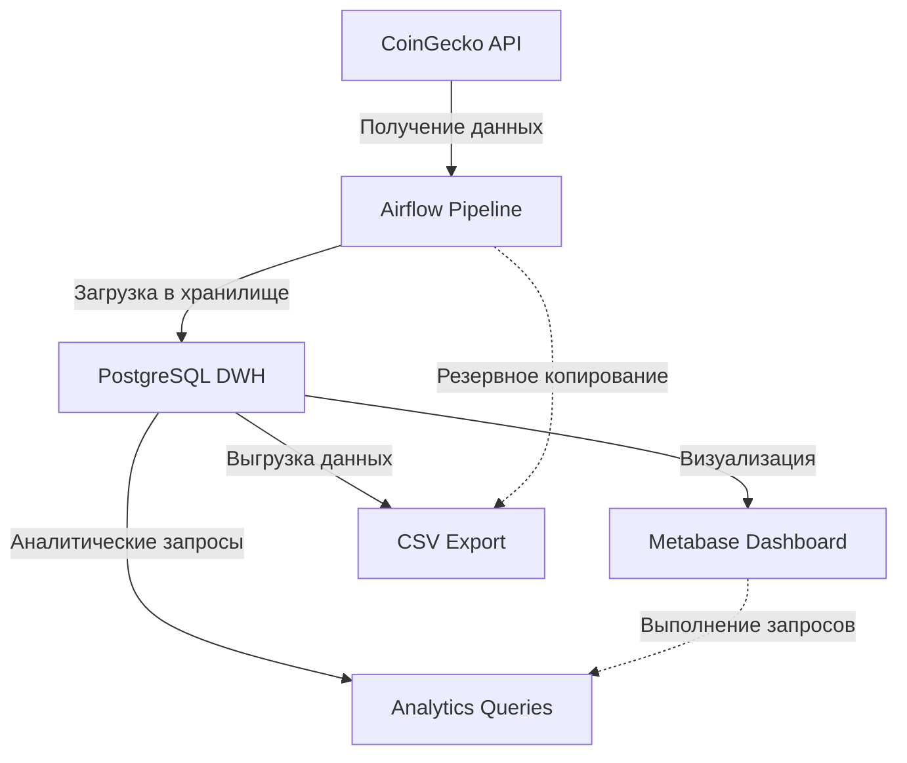

# 🚀 Crypto Market Analytics Pipeline
## ETL-пайплайн для сбора и анализа данных криптовалют с Airflow и PostgreSQL

---

## 📋 **О проекте**

**Crypto Analytics Pipeline** — это полноценный ETL-пайплайн, который автоматически собирает данные о криптовалютах с CoinGecko API, обрабатывает их и сохраняет в PostgreSQL с многослойной архитектурой (Raw → DDS → DM). Проект демонстрирует профессиональный подход к Data Engineering.

### ✨ **Возможности**
- ✅ Автоматический сбор данных **каждые 10 минут**
- ✅ Интеграция с **CoinGecko API** (Bitcoin, Ethereum)
- ✅ **Трёхуровневое хранилище** (сырые данные → детальный слой → витрины)
- ✅ **Обработка ошибок**
- ✅ **Контейнеризация** через Docker
- ✅ **Визуализация** в Metabase

---

## 🏗 **Архитектура**

### 📊 **Слои данных**

| Слой | Назначение | Таблицы |
|------|------------|---------:|
| **Raw** | Сырые данные как есть | `raw.crypto_snapshot` |
| **DDS** | Детальный слой (dim/fact) | `dds.dim_coin`, `dds.fact_market_data` |
| **DM** | Витрины для аналитики | `dm.market_summary` |

---

## 🛠 **Технологический стек**

| Компонент | Технология | Назначение |
|-----------|:------------:|------------|
| **Оркестрация** | Apache Airflow 2.8.1 | Управление ETL процессами |
| **Хранилище** | PostgreSQL 15 | Хранение данных |
| **Язык** | Python 3.11 | Скрипты ETL |
| **Контейнеризация** | Docker + Docker Compose | Изоляция окружения |
| **API** | CoinGecko | Источник данных |
| **Визуализация** | Metabase | Интерактивные дашборды |
| **Библиотеки** | `requests`, `psycopg2`, `pandas` | Обработка данных |
